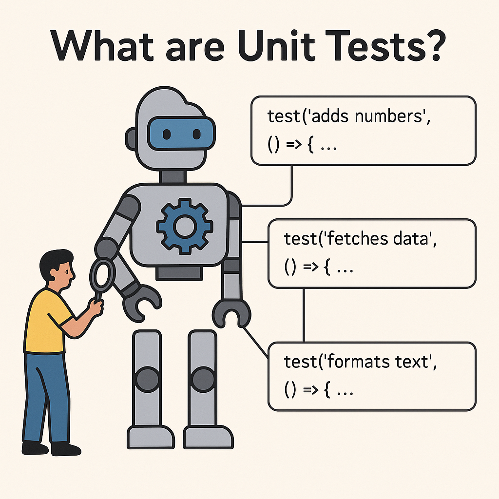

# Pruebas unitarias con jest


> Así como los músicos afinan sus instrumentos antes de tocar una canción, los desarrolladores afinan su código con pruebas unitarias.

Imagina que quieres armar un robot pero tienes que probar todas sus piezas por separado: los brazos, las piernas, la cabeza, etc. ¿Por qué? porque si el brazo derecho del robot no suma bien, es mejor saberlo antes de que todo el robot esté construido.




## ¿Para quién son los tests unitarios?

| Perspectiva              | Explicación clara                                                                 |
|--------------------------|-----------------------------------------------------------------------------------|
| 👨‍💻 Para el programador     | Le permiten detectar errores antes de que el software llegue al usuario. Son como una red de seguridad. |
| 🎯 Para el código          | Aseguran que cada parte del sistema funciona correctamente, de forma aislada.     |
| 😊 Para el usuario         | Aunque no ve los tests, sí disfruta un producto más estable, sin errores visibles. |


# ¿Qué es Jest?

Jest es un framework de pruebas hecho por Facebook que funciona de maravilla con JavaScript. Nos ayuda a:

- Ejecutar pruebas automáticamente.
- Ver rápidamente qué pasa si algo falla.
- Aprender de nuestros errores en tiempo real.


## Enviar una notificación a un usuario

Imagina que trabajas en una app de mensajería tipo WhatsApp. Tienes una función que envía notificaciones a los usuarios.

```js
function enviarNotificacion(usuario) {
  return `📩 Notificación enviada a ${usuario.nombre}`;
}
```

## ¿Qué puede salir mal?
Supón que se llama así:

```js
const usuario = null;
enviarNotificacion(usuario);
```

Esto generará un error como:

```js
TypeError: Cannot read property 'nombre' of null
```

> ⚠️ Esto rompe la app en producción. Y lo peor es que el usuario no sabrá por qué no recibió su notificación. Tú tampoco... a menos que tengas pruebas.

## ✅ Pruebas unitarias con Jest

```js
const { enviarNotificacion } = require('./notificaciones');

test('envía notificación correctamente a un usuario con nombre', () => {
  const usuario = { nombre: 'María' };
  expect(enviarNotificacion(usuario)).toBe('📩 Notificación enviada a María');
});

test('lanza error si el usuario es null', () => {
  expect(() => enviarNotificacion(null)).toThrow('Usuario no válido');
});
```

## Mejora con control de errores

Para pasar la prueba anterior, corregimos la función:

```js
function enviarNotificacion(usuario) {
  if (!usuario || !usuario.nombre) {
    throw new Error('Usuario no válido');
  }
  return `📩 Notificación enviada a ${usuario.nombre}`;
}

module.exports = { enviarNotificacion };
```

## Testing para componentes React con Vitest

Por qué usamos Vite + Vitest en vez de Jest?
Cuando trabajamos con React, una de las cosas importantes es poder probar nuestros componentes. Hay varias herramientas para eso, y una de las más conocidas es `Jest`. Pero como estamos usando Vite para nuestro proyecto, lo mejor es usar **Vitest**, que está hecha para funcionar perfectamente con Vite.

Basicamente:

- **Vitest se lleva mejor con Vite:** Como Vite es quien "enciende" nuestra aplicación y carga todos los archivos, Vitest ya entiende todo lo que Vite usa: React, archivos .jsx, CSS, imágenes, etc. Con Jest tendríamos que configurar todo eso manualmente.

- **Es más rápido:** Vitest usa una tecnología muy veloz para procesar los archivos, así que los tests se ejecutan casi al instante. Esto te permite probar tu código sin tener que esperar.

- **Casi no hay que configurar nada:** Con Jest hay que instalar varias cosas extra (como Babel) para que entienda React y JSX. Con Vitest, solo necesitas instalar un plugin y ya funciona con React.

- **La forma de escribir los tests es igual:** Vitest usa la misma estructura que Jest:

```js
test('algo', () => {
  expect(...).toBe(...);
});
```
> Así que si ya sabes usar Jest, te sentirás cómodo con Vitest.

¿Qué necesitas instalar para testear React? En un proyecto de React hecho con Vite o Create React App, normalmente ya viene casi todo. Si no, puedes instalarlo así:

```bash
npm install --save-dev vitest @vitejs/plugin-react @testing-library/react @testing-library/jest-dom
```

Y añade en tu package.json un script para lanzar los tests con Vitest:

```json

  "scripts": {
    "test": "vitest"
  }
```

Configura Vite para Vitest y JSX. En la raíz de tu proyecto, edita si ya lo tienes (o crea) vite.config.js:

```js
import { defineConfig } from 'vite'
import react from '@vitejs/plugin-react'

export default defineConfig({
  plugins: [react()],
  test: {
    globals: true,              // permite usar test, expect… sin importarlos
    environment: 'jsdom',       // simula un navegador
    transformMode: {
      web: [/\.[jt]sx?$/]       // que esbuild procese .js/.jsx/.ts/.tsx
    }
  }
})
```

Recuerda que **Vitest** reconocerá y transformará JSX sólo en archivos con extensión .jsx o .tsx. Por ejemplo:

```bash
src/js/test/Home.test.jsx
```

### Ejemplo pedagógico: MiComponente.jsx


```jsx
// MiComponente.jsx
import React from 'react';

function MiComponente() {
  return <h1>Hola, soy un componente!</h1>;
}

export default MiComponente;
```


### Testear que renderiza contenido HTML

```jsx
// src/js/test/MiComponenteRender.test.jsx
import { render, screen } from '@testing-library/react'
import MiComponente from '../components/MiComponente'

test('el componente renderiza HTML', () => {
  const { container } = render(<MiComponente />)
  expect(container.firstChild).not.toBeNull()
})
```
